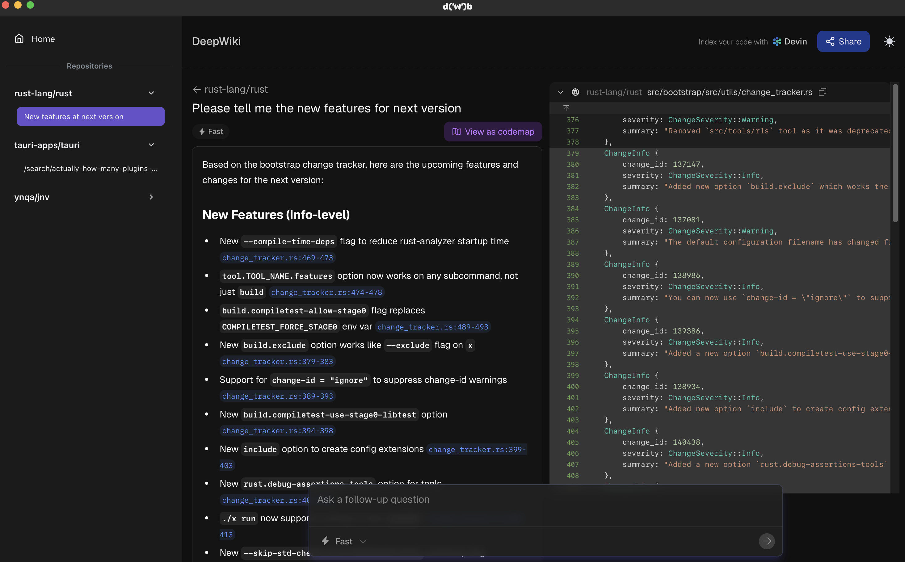

# DeepWiki Browser

  

DeepWiki Browser (a.k.a. `dwb`) is a desktop application that automatically tracks
DeepWiki browsing sessions and organizes them by repository for easy navigation.

> [!NOTE]
> This application is an **unofficial** app for Devin and is not endorsed, provided, or supported by the developers of Devin.

  

## Installation

### macOS

### Windows

### Linux

## Overview

`dwb` automatically tracks URL changes in the embedded DeepWiki WebView and manages the following data:

- Repositories
- Sessions (e.g. `search/xxx`) associated with each repository

## Features

- Display of repositories and their sessions
  - By automatic tracking of DeepWiki URL changes
- Right-click context menu for easy deletion of repositories and sessions from UI
  - Also renames the sessions for clarity
- Check for updates to notify users when a new version is available
